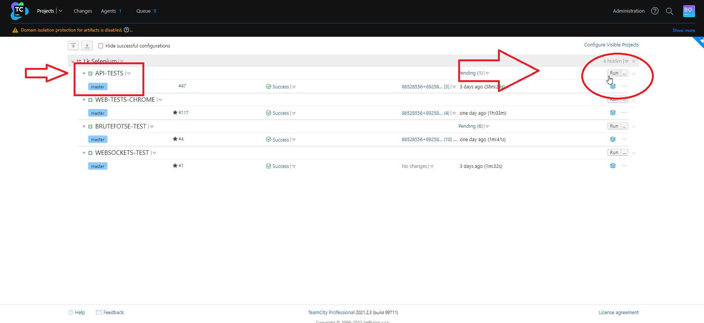
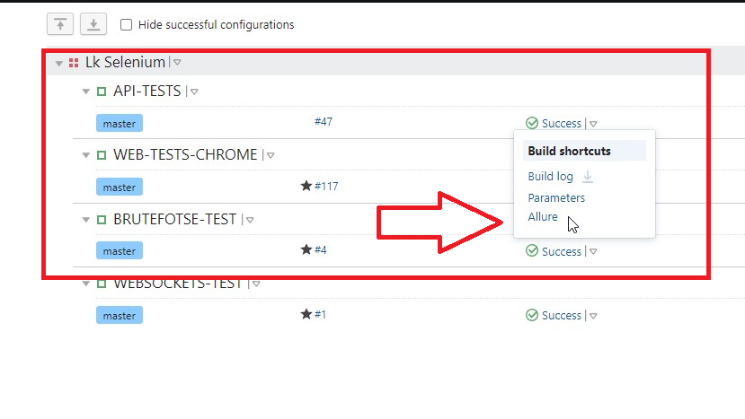
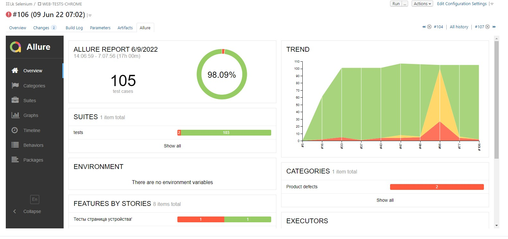
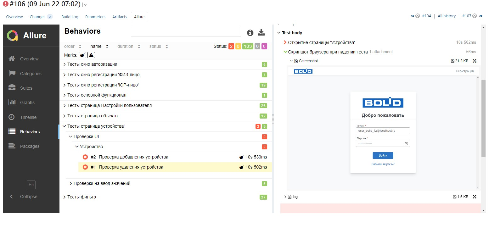

<p align="center">
  
    
</p>


# Проект по автоматизации тестирования
## [Документация](http://confluence.bolid.ru/pages/viewpage.action?pageId=60820024)

### &nbsp;&nbsp;&nbsp;&nbsp;&nbsp;&nbsp;&nbsp;&nbsp;&nbsp;:heavy_check_mark: [вход в Систему](http://192.168.22.159/)

## :rocket: Технологии и инструменты

<p  align="center"

<code></code>
<code></code>
<code></code>
<code></code>
<code></code>
<code></code>
<code></code>
<code></code>
</p>

> *В данном проекте автотесты написаны на <code><strong>*Python*</strong></code> с использованием фреймворка <code><strong>*PyTest*</strong></code> для UI-тестов и <code><strong>*requests*</strong></code> для API-тестов.*
>
>*Запуск тестов выполняется из <code><strong>*TeamCity*</strong></code>.*
>
>*<code><strong>*Allure Report*</strong></code> используются для визуализации результатов тестирования.*

## Реализованы проверки

### &nbsp;&nbsp;&nbsp;&nbsp;&nbsp;&nbsp; UI

> - [x] *Тесты на валидацию полей ввода*
> - [x] *Тесты на проверку Ui элементов*
> - [x] *Тесты на проверку сохранения*


### &nbsp;&nbsp;&nbsp;&nbsp;&nbsp;&nbsp; API

> - [x] *Тесты на проверку ответов от сервера*


## :computer: Запуск тестов из терминала


&nbsp;*Установка зависимостей:*

```bash
pip install --proxy http://<username>:<password>@proxy.bolid.ru:3128 -r requirements.txt
```

&nbsp;*Запуск всех тестов:*

```bash
python -m pytest tests/
```

&nbsp;*Запуск тестов с отчетом Allure:*

```bash
python -m pytest --browser=chrome --alluredir=allure_reports/  tests/<нужный тест>

```

где:
>- [x] *--browser - браузер, в котором будут выполняться тесты (по умолчанию chrome)*
>- [x] *--alluredir - папка в которую будут складываться отчеты*
>- [x] *tests/<нужный тест> - указывается нужный тест для запуска, либо указывается просто "tests/" для прогона всех тестов*


&nbsp;*Сформировать allure отчет:*

```bash
allure serve allure_reports/
```

##  Запуск тестов в [TeamCity](http://192.168.22.130:8112/)


*Для запуска сборки необходимо выбрать интересующий build и нажать кнопку <code><strong>*RUN*</strong></code>.*

<p align="center">
  
</p>

*После выполнения сборки, в блоке <code><strong>*Статус сборки*</strong></code> появится выпадающий список с полем Allure
<code><strong>*Allure
Report*</strong></code>, кликнув по которому, откроется страница с сформированным html-отчетом.*

<p align="center">
  
</p>

##  Отчет о результатах тестирования в [Allure Report](http://192.168.22.130:8112/viewLog.html?buildId=3207&buildTypeId=Signal_SeleniumTests&tab=report_project8_ALLURE)

### :pushpin: Общая информация

*Главная страница Allure-отчета содержит следующие информационные блоки:*

> - [x] <code><strong>*ALLURE REPORT*</strong></code> - отображает дату и время прохождения теста, общее количество прогнанных кейсов, а также диаграмму с указанием процента и количества успешных, упавших и сломавшихся в процессе выполнения тестов
>- [x] <code><strong>*TREND*</strong></code> - отображает тренд прохождения тестов от сборки к сборке
>- [x] <code><strong>*SUITES*</strong></code> - отображает распределение результатов тестов по тестовым наборам
>- [x] <code><strong>*ENVIRONMENT*</strong></code> - отображает тестовое окружение, на котором запускались тесты (в данном случае информация не задана)
>- [x] <code><strong>*CATEGORIES*</strong></code> - отображает распределение неуспешно прошедших тестов по видам дефектов
>- [x] <code><strong>*FEATURES BY STORIES*</strong></code> - отображает распределение тестов по функционалу, который они проверяют
>- [x] <code><strong>*EXECUTORS*</strong></code> - отображает исполнителя текущей сборки (ссылка на сборку в Jenkins)

<p align="center">
  
</p>

### :pushpin: Список тестов c описанием шагов и визуализацией результатов

*На данной странице представляется стандартное распределение выполнявшихся тестов по тестовым наборам или классам, в
которых находятся тестовые методы.*

<p align="center">
  
</p>

[//]: # ()
[//]: # (##  Пример запуска теста в Selenoid)

[//]: # ()
[//]: # (<p align="center">)

[//]: # (  )

[//]: # (</p>)

[//]: # ()
[//]: # (##  Уведомления в Telegram)

[//]: # ()
[//]: # (<p align="center">)

[//]: # (  )

[//]: # (  )

[//]: # (</p>)


<hr>
<p align="center">
  
</p>
